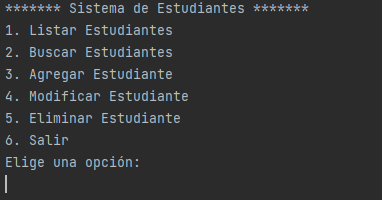

<H1>Java Avanzado</H1>

<H2>Descripción Clases</H2>

<H3>Clase 1 (Abel Pierna)</H3>
En esta primera clase de Java avanzado terminamos el proyecto que habíamos dejado inconcluso el semestre pasado, que es un app que te lista estudiantes, con su respectivo id, nombre, apellido, teléfono y email. Para esta app usamos la BD MySQL y un menú que permitiera administrar los datos, Listar los estudiantes, agregar nuevos datos, modificar los existentes o eliminar algún estudiante. 

