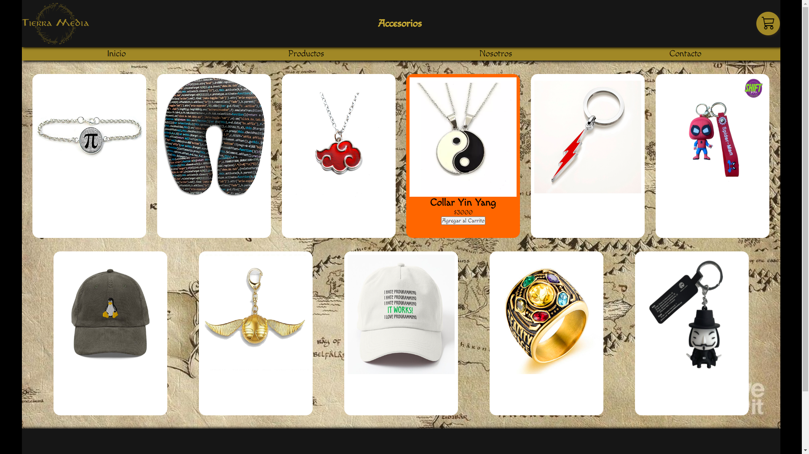
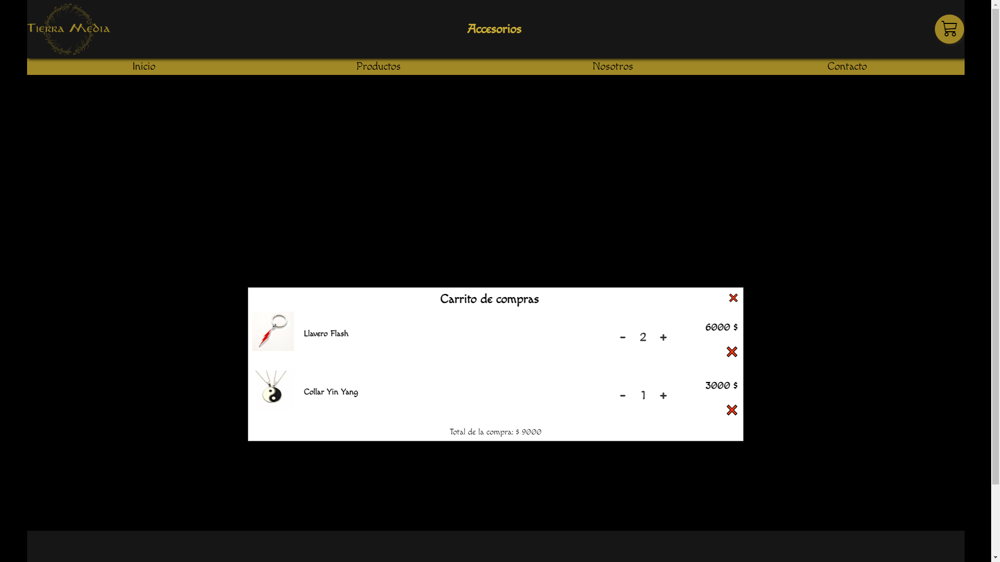

# Proyecto E-Commerce Tierra media *(Grupo: NoCode)*
## Brief del proyecto:
Click en **[Brief](./Brief.pdf)** para verlo. 
Lo que trabajamos en el proyecto integrador de este año es un E-commerce orientando al mundo geek, en el abran diferentes categorías con diferentes productos. 
##Trabajo realizado a lo largo de las semanas:

#### Scrum semana 1 *(Dante M)*: 
Comenzamos a pensar en que nicho íbamos a orientar el E-commerce. 
Se realizo el brief para empezar con el proyecto integrador. 

#### Scrum semana 2 *(Jeremias R)*: 
Cada integrante del grupo pensó en una categoría diferente y es en la que trabajó durante todo el proyecto: 
- Lucas S.(Accesorios)
- Ezequiel M.(Mangas)
- Dante M.(Comics)
- Franco L.(Armas de colección)
- Andres W.(Simpson manía)
- Abel P.(Remeras)
- Dario C.(Tazas)
- Jeremias R.(Figuras de colección) 

Y esa misma semana comenzamos creando el Index.

#### Scrum semana 3 *(Dario C)*: 
En esta semana hicimos avances en el HTML, también creamos un CSS base para todas las categorías 
Respecto a las imágenes seguimos con un patrón de renombrado para su correcto orden 

#### Scrum semana 4 *(Abel P)*: 
En esta semana cada uno de los integrantes comenzó a trabajar en su propio HTML de cada categoría.  
También renombramos las imágenes para trabajar de forma más ordenada con toda la parte de multimedia.

#### Scrum semana 5 *(Franco L)*: 
En esta semana tuvimos que arreglar los errores que cargábamos de semanas anteriores respecto a la forma de resecarla y renombrar las imágenes 
También creamos una estructura en HTML para que todos los productos sin importar su categoría estén linkeados a un mismo CSS.

#### Scrum semana 6 *(Lucas S)*: 
Por dificultades que se dieron al crear el carrito de compras, tuvimos que reestructurar todo el código. 

#### Scrum semana 7 *(Ezequiel M)*: 
Esta semana terminamos de trabajar en el carrito y empezamos a trabajar en el Readme final del proyecto y en el guion del video.  
Tambien terminamos la pasarela de pagos y la base de datos.
 

<h3 align="left">Lenguajes y herramientas:</h3>

    

